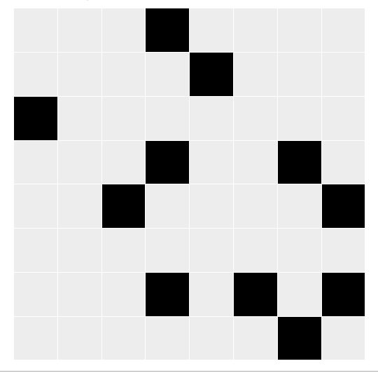

## Curso de Probabilidad Aplicada y Simulación Estocástica, IIMAS-UNAM
Este repositorio contiene notas,practicas, tareas y proyectos del curso de Probabilidad Aplicada y Simulación Estocástica impartido en la [Licenciatura en Ciencia de Datos](https://cienciadatos.iimas.unam.mx/) en el [IIMAS](https://www.iimas.unam.mx/).

## [Prácticas](practicas/)
- [Práctica 1 Matriz de Hilbert y Regla de Simpson](https://github.com/gandres-dev/Probabilidad-aplicada-y-simulacion-estocastica/blob/main/practicas/01-practica1/Practica1_PASE.pdf)
- [Práctica 2 Calculando pi con gotas de lluvia](https://github.com/gandres-dev/Probabilidad-aplicada-y-simulacion-estocastica/tree/main/practicas/02-practica2)
- [Práctica 3 Generación de Números Aleatorios](https://github.com/gandres-dev/Probabilidad-aplicada-y-simulacion-estocastica/tree/main/practicas/03-practica3)
- [Práctica 4 Simulación de una variable aleatoria](https://github.com/gandres-dev/Probabilidad-aplicada-y-simulacion-estocastica/tree/main/practicas/04-practica4)
- [Práctica 5 Método de la Transformada Inversa para V.A. Continuas](https://github.com/gandres-dev/Probabilidad-aplicada-y-simulacion-estocastica/tree/main/practicas/05-practica5)
- [Práctica 6 Método de Aceptación Rechazo](https://github.com/gandres-dev/Probabilidad-aplicada-y-simulacion-estocastica/tree/main/practicas/06-practica6)
<!-- -  -->

---
## [Proyecto (Aplicación de MCMC)](https://nbviewer.org/github/gandres-dev/Probabilidad-aplicada-y-simulacion-estocastica/blob/main/Proyecto/Codigo/Aplicacion-MCMC.ipynb)
Las técnias de Monte Carlo vía cadenas de Markov permiten generar, de menera iterativa, observaciones de distribuciones multivariadas que difícilmente podrían simularse. 

La idea básica es construir una cadena de Markov que sea fácil de simular y cuya distribución estacionaria corresponda a la distribución objetivo que nos interesa. De esta manera, al implementar correctamente el algoritmo, la convergencia de la cadena está garantizada, independientemente de cuáles sean los valores iniciales.

---
## Temario
1. **Introducción**
    1. **Modelación y aleatoreidad**
      - Modelación
      - Fenómenos aleatorios e incertidumbre
      - Un lenguaje de programación para análisis estadístico y gráfico
  
2. **Probabilidad para variables reales**
    1. **Espacios de probabilida**
      - Espacios muestrales y eventos
      - Axiomas de probabilidad
      - Generación de números pseudoaleatorios
      - Simular: Variable uniforme y Método Montecarlo
    2. **Probabilidad condicional e independencia**
      - Definición
      - Teorema de Bayes      
    3. **Variables discreta**
      - Función de probabilidad y de distribución
      - Valor esperado y varianza
      - Ejemplos básicos: Distribución Uniformr, Bernoulli, Binomial, Geométrica
    4. **Simulación de variables discretas**
      - Simular: Variables con soporte discreto y finito
      - Simular: Variables como realización de experimentos
      - Otros ejemplos: Poisson, Binomial Negativa, Hipergeométrica    
    5. **Variables continua**
      - Funciones de densidad, distribución, cuantiles, generadoras
      - Ejemplos básicos: Distribución Normal, Exponencial, Gamma, Beta
      - Simular: Método de la transformación inversa
      - Simular: Método de aceptación rechazo
      - Otros ejemplos: Dirichlet, Pareto, Chi-cuadrada, t de Student, F, Wishart

3. **Conceptos y aplicaciones de convergencia**
    1. **Tipos de convergencia**
    - Convergencia en distribución
    - Convergencia en probabilidad
    - Convergencia casi seguro
    2. **Teoremas centrales de probabilidad**
    - Ley de los grandes números
    - Teorema central del límite
    - Base del método Montecarlo
    - Base de la estimación de parámetros
  
4. **Probabilidad Multivariable**
    1. **Vectores Aleatorios**
    - Funciones de distribución y densidad conjunta
    - Funciones marginales y valor esperado
    2. **Independencia entre variables**
    - Covarianza, correlación, densidad condicional
    - Ejemplo de cópulas
    3. **Ejemplos**
    - Distribución Multinomial
    - Distribución Normal Multivariada    
    4. **Transformaciones de vectores aleatorios**
    - Cambio de variable
    - Función generadora
    - Transformaciones lineales
    - Estadísticos de orden    

5. **Cadenas de Markov**
    1. **Ejemplos**
    - Caminatas aleatorias
    - Procesos de ramificación
    - Gráficas aleatorias
    2. **Definición**
    - Probabilidades de transición
    - Ecuaciones de Chapman-Kolmogorov
    - Tiempos de paro
    3. **Comportamiento límite**
    - Distribución estacionaria
    - Clasificación de estados
    - Simular: Page Rank

6. **Modelos y Simulación estocástica (Temas selectos)**
    1. **Métodos de reducción de varianza**
    - Algoritmo de Metropolis-Hasting, Gibbs, Recocido simulado
    2. **Procesos Poisson**
    - Introducción a procesos espaciales
    - Procesos puntuales Poisson
    3. **Teoría de colas**
    - Introducción a generadores infinitesimales
    - Modelos exponenciales M/M/1, Sistemas M/G/1 y multiservidor

---
## Bibliografía básica:
1. Fishman, G.S. (2006). A First Course on Monte Carlo. Duxbury Press.
2. Ripley, B.D. (2009). Stochastic Simulation. Wiley.
3. Robert, C.P. and Casella, G. (2010). Introducing Monte Carlo Methods with R.
Springer-Verlag.
4. Ross, S.M. (2007). Introduction to Probability Models (9th ed.). Academic Press:
Amsterdam.
5. Ross,S.M. (2010). A First Course in Probability (8th ed.). Prentice-Hall: New
Jersey.

---
## Profesora
**Laura Eslava**
  <!-- - Correo: blancavazquez2013[arroba]gmail.com -->

---
## Recursos electrónicos
1. Grinstead, C.M. and Snell, J.L. (2011). Introduction to Probability. American Mathematical Society.[Liga](https://www.math.dartmouth.edu/~prob/prob/prob.pdf)
2. Kerns, G.J. (2013). IPSUR: Introduction to Probability and Statistics Using R. [Liga](https://rdrr.io/cran/IPSUR/)
3. Garcı́a-Ligero, Ma. Jesús and Román Román, Patricia (2020) Simulación R.[Liga](https://www.dropbox.com/s/d9w78p7u3a0by9u/Simulacion_R-garcia-roman.pdf?dl=0)
